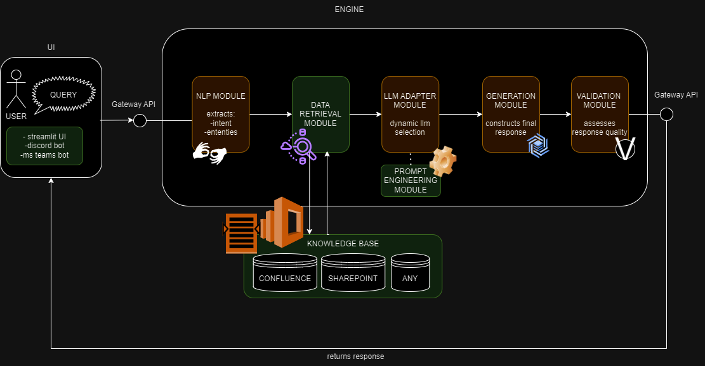

# Architecture Overview

## Introduction

This document provides a detailed overview of the architecture of the Modular Chatbot Framework. Designed with flexibility and scalability in mind, the framework is composed of several key modules, each responsible for a specific aspect of the chatbot's functionality.

## System Design

The following diagram illustrates the high-level architecture of the system:

### Components

1. **API Gateway**: Central hub for managing and routing all incoming and outgoing requests.
2. **Chatbot Engine**: Core of the application, consisting of several modules:
   - NLP Module
   - Data Retrieval Module
   - LLM Adapter Module
   - Generation Module

For more detailed information about each module, please refer to the [Module Descriptions](#module-descriptions).

## Data Flow

The data flow through the system is as follows:

1. **User Interface** sends a query to the **API Gateway**.
2. **API Gateway** routes the query to the **NLP Module** for processing.
3. **NLP Module** parses the query and sends the results to the **Data Retrieval Module**.
4. **Data Retrieval Module** fetches necessary data and passes it along to the **LLM Adapter Module**.
5. **LLM Adapter Module** processes the data with the appropriate LLM and sends the results to the **Generation Module**.
6. **Generation Module** generates the final user response and sends it back through the **API Gateway** to the **User Interface**.

## Modularity and Flexibility

Each component in the system is designed as a modular unit, allowing for easy updates, maintenance, and scalability. This design supports the integration of additional data sources, LLMs, or changes in deployment environments without major overhauls of the system.

For further details on each module's functionality and design, refer to the [Module Descriptions](#module-descriptions).
